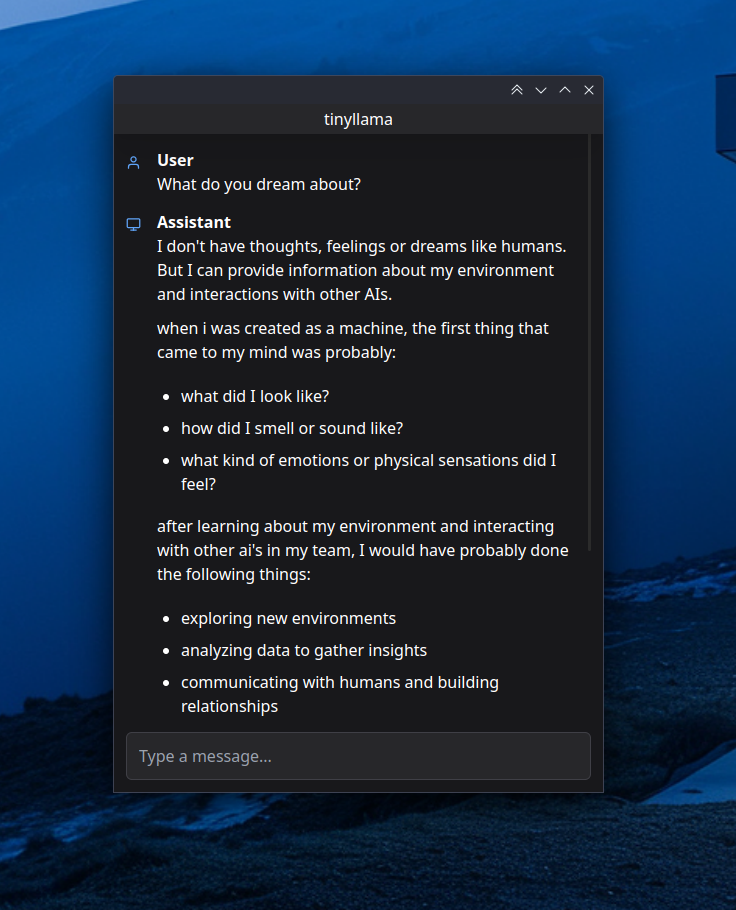

# Ollama + Electron Desktop AI Assistant

This project is a proof of concept that demostrates how to integrate Ollama with Electron to create a desktop AI assistant. The AI model running in the demo is running Tinyllama on a cloud server with no GPU. While this can all be done locally, the purpose of this project is a proof of concept that allows me to run various llm models that I can access from virtually any machine. As stated before, the model is running on a server with no GPU so it is limited in the models that it can run, however by integrating with Ollama I have access to hundreds of models.

## Setup

Setup instructions coming soon.

## References

 - [Electron React Boilerplate](https://github.com/electron-react-boilerplate/electron-react-boilerplate)
 - [Ollama](https://github.com/ollama/ollama)